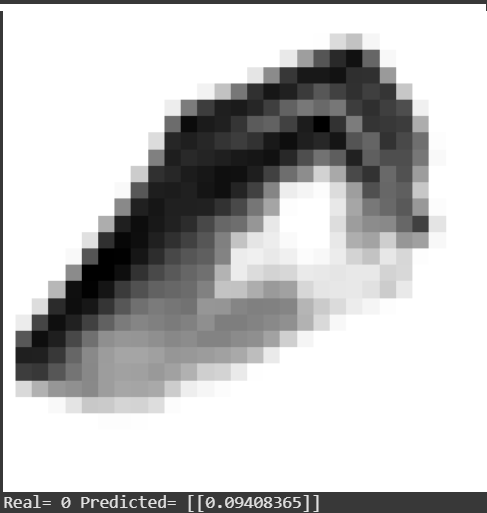
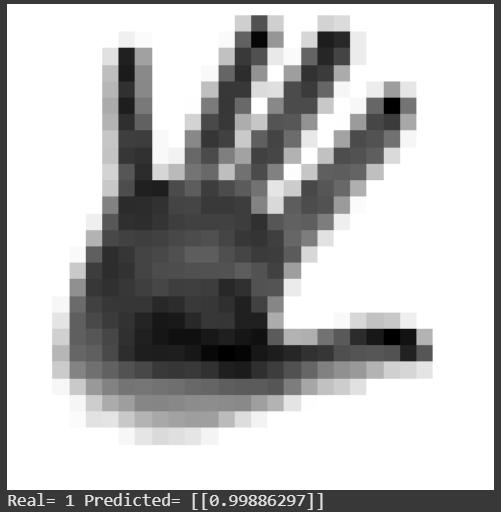
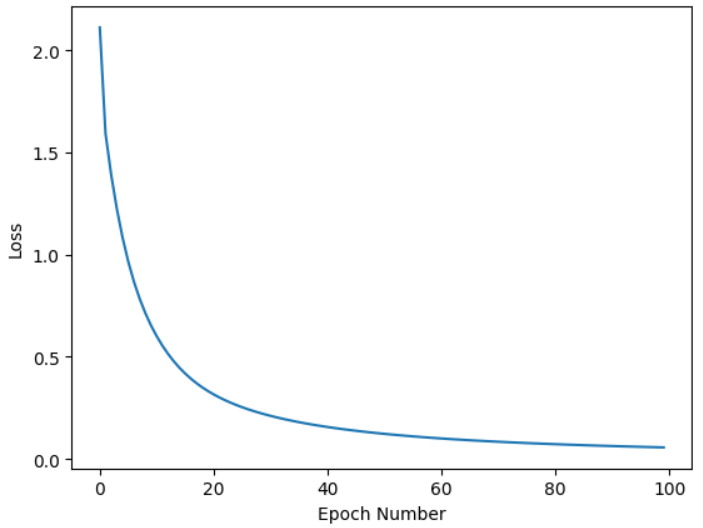
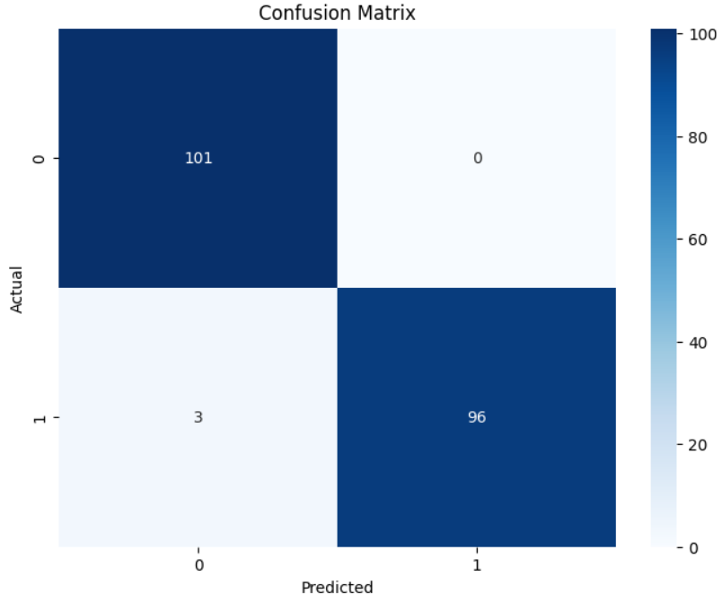

---
author:
  - Guy Houri, Yoav Gal
bibliography:
  - references.bib
date: Submitted as mid-semester project report for Basic Of Deep
  Learning course, Colman, 2024
nocite: "[@*]"
title: Basic Of Deep Learning - Mid Semester Project Part 1
---
**Important Notice: Consult the PDF for Best Accuracy**

This Markdown document was automatically generated from LaTeX source code. While the conversion process was successful for most of the content, some formatting discrepancies or errors may exist, especially in complex mathematical equations and algorithms. For the definitive and most accurate version of this document, we strongly recommend consulting the original [PDF file](presentation.pdf).

# Introduction

Image classification has emerged as a cornerstone of modern computer
vision, enabling machines to recognize and categorize visual information
with remarkable accuracy. This project delves into the realm of binary
image classification, specifically focusing on distinguishing between
images of fingers displaying the digits \"0\" and \"5.\"
This project leverages core deep learning techniques to address the
image classification task. The use of a neural network with a hidden
layer allows the model to learn complex nonlinear relationships between
input pixels and class labels. Backpropagation, a fundamental algorithm
in deep learning, enables the network to iteratively refine its
parameters by propagating the error signal back through the network and
adjusting the weights accordingly. The choice of the sigmoid activation
function and the cross-entropy loss function are crucial for binary
classification problems, facilitating efficient training and accurate
predictions. By employing these deep learning techniques, the model can
effectively extract meaningful features from the input images and
achieve high classification accuracy.
Through this project, our aim is to: 1. Develop a functional image
classification model for the given task. 2. Investigate the impact of
different hyperparameters on model performance. 3. Gain practical
experience in the implementation and training of a neural network. 4.
Deepen our understanding of the core concepts and techniques in deep
learning.
This report will detail the data preprocessing steps, model
architecture, training process, and evaluation results. In addition, we
will discuss the challenges encountered during the project and potential
avenues for future improvement.

## Data

The data set we will be working on is called Sign Language Digits. This
data set contains 5,000 black and white images divided into 10 different
types of hand sign representing numbers 0 to 9. The size of each
individual image is 28x28 pixels. The data set file is a NumPy array
containing the image pixels. It includes 5,000 rows for each image and
784 columns for each pixel in the image (28x28).

## Problem

This project tackles the challenge of recognizing handwritten digits in
sign language from images. Sign language presents unique challenges for
image classification due to the inherent variability in human hand
gestures. Factors such as differences in hand size, orientation,
lighting conditions, and individual variations in hand shape can
significantly impact the accuracy of digit recognition.

# Solution

## General approach

This project employs a supervised machine learning approach. A
feedforward neural network with a single hidden layer is utilized to
classify the images. The network processes the raw pixel data from each
image and learns to extract relevant features through the hidden layer.
The output layer generates a probability for each class (0,5). This
architecture allows the model to learn complex nonlinear relationships
between the input pixels and the corresponding digit.

## Design

### Environment

This project was implemented and executed using a Jupyter Notebook
environment hosted on Google Colaboratory (Colab). The notebook, saved
in the .ipynb format, provided an interactive platform for code
development, experimentation, and documentation. Python, with its
extensive collection of libraries specifically designed for numerical
computation (NumPy), machine learning (scikit-learn), was used
throughout the project. Colab's cloud-based infrastructure offered
access to necessary computational resources and we were able to run our
model in a very short time.

### Architecture

[Pre Processing]{.underline}
Filter, Normalize, and Split to train and test.

    # filter
    mask = (y == "0") | (y == "5")
    X_filtered = X[mask]
    Y_filtered = y[mask]

    # Normalize
    X = X_filtered/255.0 # to become value from 0-1 insted of 0-255

    # Split
    indices = np.random.permutation(X.shape[1])
    split_point = int(0.8 * X.shape[1])
    X_train, X_test = X[:, indices[:split_point]], X[:, indices[split_point:]]
    Y_train, Y_test= Y[:, indices[:split_point]], Y[:, indices[split_point:]]

[Activation function]{.underline}
We chose sigmoid. This introduces curves and bends, allowing the network
to learn more complex patterns and relationships in the data through non
linear transformations.

    def sigmoid(x):
        return 1 / (1 + np.exp(-x))

[Loss function]{.underline}
Binary cross-entropy - measures the dissimilarity between predicted
probabilities and true binary labels (0 or 1), quantifying the error of
a binary classification model's predictions. in the function we avoid
log(0) by assigning y-hat a value that is closeToZero with numpy clip
function

    def log_loss(y_hat, y):
        closeToZero = 1e-15
        y_hat = np.clip(y_hat, closeToZero, 1 - closeToZero)
        loss = - (y * np.log(y_hat) + (1 - y) * np.log(1 - y_hat))
        return loss

[Hyperparameters]{.underline}
Hyperparameters are settings that are set before training a machine
learning model and control the learning process itself, influencing how
the model learns the underlying patterns in the data. Our input layer is
784 features (28\*28) pixels.
**Hidden layer** - we chose a hidden layer of 128 neurons. A larger
hidden layer can potentially learn more complex patterns, but also
increases the risk of overfitting (memorizing the training data instead
of generalizing to new data). A smaller hidden layer might not have
enough capacity to learn the underlying patterns. In our case, 128
worked well. In computer science, powers of 2 are often preferred for
memory allocation and data processing because they align well with the
binary nature of computers.
**Learning rate** - During training, the neural network adjusts its
weights and biases to minimize the loss function. The learning rate
scales the gradient of the loss function, determining how much weights
and biases are updated in each iteration. In our case, we chose 0.01
**Epochs** - the number of times the entire training dataset is passed
through the neural network during training. More epochs allow the model
to learn more from the data, but too many epochs can lead to
overfitting. for our case epochs=100 was fine.
**Batch Size** - controls how many training examples are processed in
each iteration of the training process. It affects the stability of the
gradients, memory usage, and training speed. our batch size is 32.
[Forward Propagation]{.underline}
Multiplying neurons by weights and adding biases, after which they are
passed through the activation function.

    Z1 = np.matmul(W1, X_batch) + b1
    A1 = sigmoid(Z1)  # Store sigmoid output for reuse
    Z2 = np.matmul(W2, A1) + b2
    A2 = sigmoid(Z2)

### Back Propagation

Back Propagation is the calculations of gradients of the loss function
with respect to the network's weights. These gradients are then used to
update the weights, iteratively minimizing the error and improving the
network's performance. The gradients indicate the direction of the
steepest ascent of the loss function. Backpropagation calculates the
negative of the gradients to find the direction of steepest descent
(towards the minimum). We calculate the gradient by the derivative.

:::: algorithm
::: algorithmic
Training data $(X, Y)$, Loss function $L(\theta)$, Learning rate $\eta$,
Initial parameters $\theta$

Optimized parameters $\theta$

$\nabla L(\theta) \gets \text{Calculate gradient of } L(\theta) \text{ with respect to } \theta$
$\theta \gets \theta - \eta \cdot \nabla L(\theta)$

**return** $\theta$
:::
::::

**Derivative Calculation**
**${dZ_2}$ = $\frac{dL}{dZ_2}$ = $\frac{dL}{dA_2}$ \*
$\frac{dA_2}{dZ_2}$** (chain rule)
we begin the backward pass by considering the derivative of the loss
function L. oss L is not directly a function of Z2. It's a function of
A2, which is a function of Z2. We need the chain rule to \"bridge the
gap.\"

$$
\begin{aligned}
\frac{dL}{da} &= \frac{d}{da} \left( -[y \cdot \log(a) + (1-y) \cdot \log(1-a)] \right) \\
&= -\left[ y \cdot \frac{1}{a} - (1-y) \cdot \frac{1}{1-a} \right] \\
&= -\frac{y}{a} + \frac{1-y}{1-a} \\
&= \frac{-y(1-a) + (1-y)a}{a(1-a)} \\
&= \frac{-y + ay + a - ay}{a(1-a)} \\
&= \frac{a - y}{a(1-a)}
\end{aligned}
$$

Therefore:

$$
\frac{dL}{dA_2} = \frac{A_2 - y}{A_2(1-A_2)}
$$

To find the derivative $\frac{dA_2}{dZ_2}$, we can rewrite the sigmoid
function as:

$$
A_2 = (1 + e^{-Z_2})^{-1}
$$

$$
\begin{aligned}
\frac{dA_2}{dZ_2} &= \frac{e^{-Z_2}}{(1 + {e^{-Z_2}})^2} \\
&= \frac{1}{1 + e^{-Z_2}} \cdot \frac{e^{-Z_2}}{1 + e^{-Z_2}} \\
&= \frac{1}{1 + e^{-Z_2}} \cdot \left(1 - \frac{1}{1 + e^{-Z_2}}\right) \\
&= A_2 \cdot (1 - A_2)
\end{aligned}
$$

Therefore:

$$
\frac{dA_2}{dZ_2} = A_2(1 - A_2)
$$

$$
\begin{aligned}
\frac{dL}{dZ_2} &= \frac{dL}{dA_2} \cdot \frac{dA_2}{dZ_2} \\
&= \frac{A_2 - y}{A_2(1-A_2)} \cdot A_2(1-A_2) \\
&= A_2 - y
\end{aligned}
$$

This is why, in many implementations with sigmoid output and binary
cross entropy, you directly see $\frac{dL}{dZ_2} = A_2 - y$ being used
in the backpropagation calculations.

    dZ2 = (A2 - Y_batch.reshape(1, -1))

**dW2**

$$
Z_2 = W_2 A_1 + b_2
$$

$$
\frac{\partial L}{\partial W_2} = \frac{\partial L}{\partial Z_2} \frac{\partial Z_2}{\partial W_2}
$$

Thus:

$$
\frac{\partial Z_2}{\partial W_2} = A_1
$$

$$
\frac{\partial L}{\partial W_2} = \frac{\partial L}{\partial Z_2} A_1
$$

    dW2 = np.matmul(dZ2, A1.T) / batch_size

**dB2**

$$
\frac{\partial L}{\partial B_2} = \frac{\partial L}{\partial Z_2} \frac{\partial Z_2}{\partial B_2}
$$

Thus:

$$
\frac{\partial Z_2}{\partial B_2} = 1
$$

$$
\frac{\partial L}{\partial B_2} = \frac{\partial L}{\partial Z_2}
$$

    db2 = np.sum(dZ2, axis=1, keepdims=True) / batch_size

All the code Together:

    dZ2 = (A2 - Y_batch.reshape(1, -1)) # Reshape Y_batch for proper subtraction
    dW2 = np.matmul(dZ2, A1.T) / batch_size # Average over batch
    db2 = np.sum(dZ2, axis=1, keepdims=True) / batch_size # Average over batch

    dA1 = np.matmul(W2.T, dZ2)
    dZ1 = np.multiply(dA1, sigmoid_derivative(Z1)) # Reuse sigmoid output (A1)
    dW1 = np.matmul(dZ1, X_batch.T) / batch_size # Average over batch
    db1 = np.sum(dZ1, axis=1, keepdims=True) / batch_size # Average over batch

    # Update weights
    W2 = W2 - learning_rate * dW2
    b2 = b2 - learning_rate * db2
    W1 = W1 - learning_rate * dW1
    b1 = b1 - learning_rate * db1

# Base Model

Our model recives a 28\*28 pixel matrix, where each value is between
0-255. afterwards we process the data to be between 0-1. the matrix
represents a grayscale image of a sign symbol 0 or 5. The output of the
model is a number between 0-1, the closer it is to 0 - the model guesses
that the sign is 0. the closer it is to 1 - the model guesses that the
sign is 5.
Prediction Examples:

<figure id="fig:predictedZero">

<figcaption>predicted sign 0</figcaption>
</figure>

<figure id="fig:predictedOne">

<figcaption>predicted sign 5</figcaption>
</figure>

## Results and Metrics

This section presents the results of the trained neural network model on
the sign language digit classification task. The model's performance is
evaluated using various metrics, including loss, accuracy, precision,
recall, and the confusion matrix.\

### Loss

The training process was monitored by tracking the binary cross-entropy
loss function. As shown in Figure 1, the training loss decreased
steadily over the epochs, indicating that the model was effectively
learning from the data. The validation loss also exhibited a similar
trend, suggesting that the model was not overfitting significantly.

{#fig:loss_graph width="60%"}

### Confusion Matrix

The confusion matrix provides a detailed breakdown of the model's
performance by categorizing predictions into four categories: True
Positives (TP), True Negatives (TN), False Positives (FP), and False
Negatives (FN). The model is exhibiting high accuracy in classifying the
data. It is effectively distinguishing between the two classes with
minimal misclassifications. as seen in figure 2 with heat map confusion
matrix.

{#fig:confusion_matrix
width="75%"}

### Classification Report

We used sklearn library in order to show classification report
including: accuracy, precision, recall, and f1.

**Accuracy**

$$
Accuracy = \frac{TN + TP}{TN + TP + FN + FP}
$$

Represents
the proportion of correctly classified samples out of the total number
of samples in the test set.

**Precision**

$$
\begin{aligned}
    \text{Precision} &= \frac{\text{True Positives}}{\text{True Positives} + \text{False Positives}}
\end{aligned}
$$

High precision indicates that the model is reliable in
its positive predictions, minimizing the number of false alarms.

**Recall**

$$
\begin{aligned}
\
    \text{Recall} &= \frac{\text{True Positives}}{\text{True Positives} + \text{False Negatives}}
\end{aligned}
$$

Recall, also known as sensitivity, measures the model's
ability to identify all actual positive instances. High recall ensures
that the model effectively captures all relevant instances, minimizing
the number of missed detections.

**F1-Score**

$$
F1-score = 2 \times \frac{Precision \times Recall}{Precision + Recall}
$$

The F1-score is calculated as the harmonic mean of precision and recall.
It is a single metric that combines them both. An F1-score of 1
indicates perfect precision and recall. A lower F1-score indicates an
imbalance between precision and recall.

\* support - number of samples \* macro avg - The average of the metrics (precision, recall, f1-score)
calculated for each class, giving equal weight to each class. \* weighted avg - The weighted average of the metrics, where each class
is weighted according to its support (number of samples).

::: {#tab:classification_report}
precision recall f1-score support

---

0 digit sign 0.97 1.00 0.99 101
5 digit sign 1.00 0.97 0.98 99
accuracy 0.98 200
macro avg 0.99 0.98 0.98 200
weighted avg 0.99 0.98 0.98 200

: Model Classification Report
:::

The model demonstrates high accuracy (0.98) in classifying sign language
digits, with both precision and recall exceeding 0.97 for both classes
(0 and 5). This indicates strong performance in accurately identifying
and classifying hand gestures representing these digits

# Discussion

Overall, this project provided valuable insights into the application of
deep learning for image classification in the context of sign language
recognition. We successfully demonstrated the feasibility of utilizing a
feed-forward neural network for binary classification of sign language
digits (0 and 5). The model achieved high accuracy (0.98) with excellent
precision and recall for both classes, indicating strong performance in
distinguishing between the two hand gestures.  
[Key Findings:]{.underline}
**Strong Performance** - Employing a simple neural network architecture
with a single hidden layer achieved good results, suggesting the
potential of deep learning for this task.
[Limitations and Considerations:]{.underline}

**Dataset Expansion:** Utilize a dataset encompassing all ten sign
language digits (0-9) to enhance the model's generalizability and
applicability to real-world scenarios.

**Hyperparameter Tuning:** Further optimize the model through
hyperparameter tuning. Experiment with different learning rates, number
of neurons in the hidden layer, and other parameters to potentially
improve accuracy.

**Advanced Architectures:** Implement and evaluate more advanced deep
learning architectures like CNNs, specifically designed for image
classification tasks. These architectures excel at extracting spatial
features from images, potentially leading to significant performance
gains.
[Conclusion]{.underline}
This project has demonstrated the promise of deep learning for basic
sign language digit recognition. The achieved accuracy and insights
gained provide a valuable foundation for further exploration and
development in this area. By addressing the limitations identified,
exploring future directions, and considering potential applications,
this research can significantly contribute to advancements in deep
learning technologies.

# Code

[Link to
notebook](https://colab.research.google.com/drive/17l2Hzcw9iYNcaJ6eD4uKhlNWUl5fsWA1?usp=sharing)

Good luck!!
